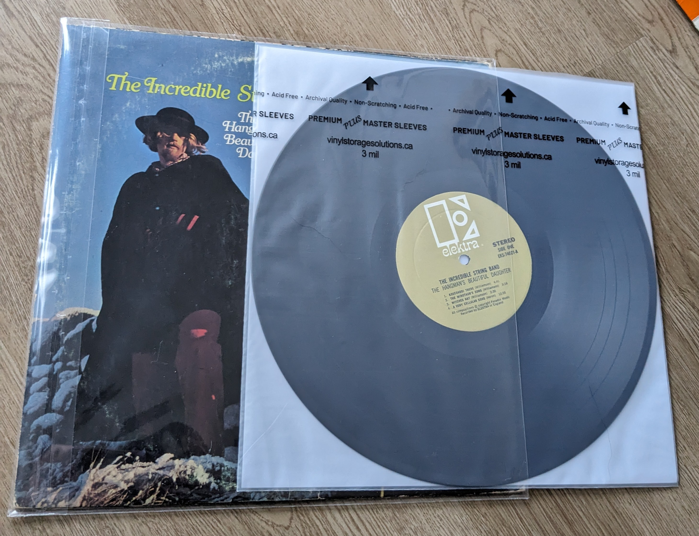
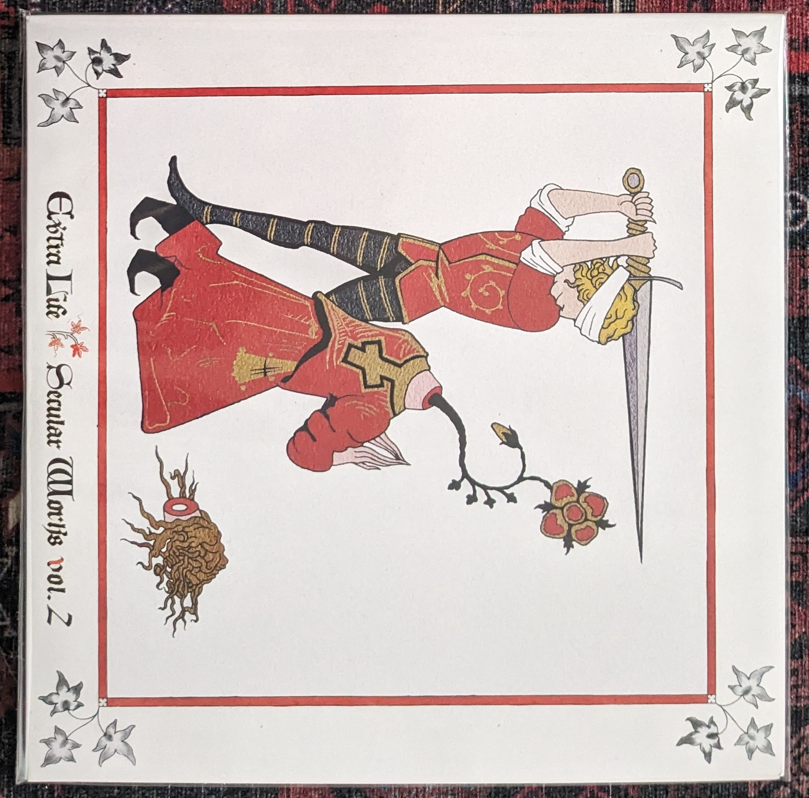
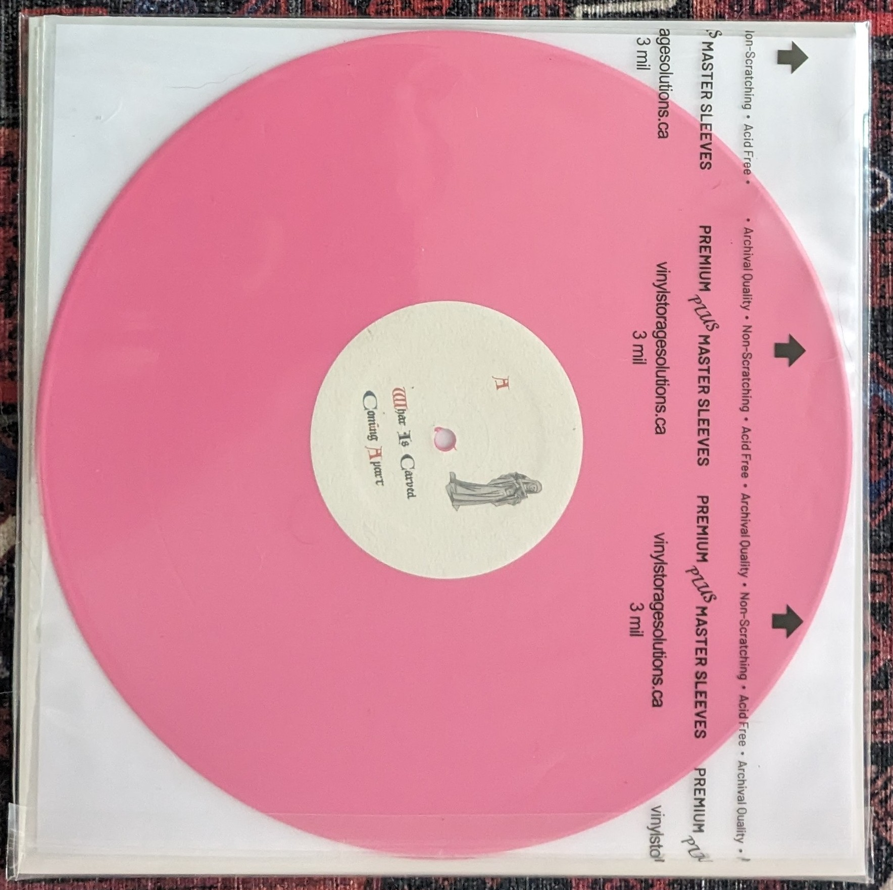

I've relocated across the United States twice in the last 2 years. My records have slowly decremented an entire Goldmine Standard grade, each move introducing myriad opportunities for newly-acquired crushed corners and sleeve creases. This is really unfortunate because I've slowly accumulated a very deliberate collection of rare pieces, nearly all of them first pressings.

I noticed this a few weeks ago after we moved in to our new residence; my first press copy of [Teenage Head in My Refrigerator](https://www.discogs.com/master/84997-The-Deep-Freeze-Mice-Teenage-Head-In-My-Refrigerator) by the Deep Freeze Mice has been sitting in this shitty, flimsy saran wrap sleeve; I've several box sets with no protection whatsoever, and my [Zs 33](https://www.discogs.com/release/3168387-Zs-33) 7-inch is slowly developing a ring in the front of the sleeve (the hand-screened linen is also bending on the left side). It's absolutely disgusting, and I'm pissed at myself for ever allowing things to get to this point.

Thus, I embarked on a research endeavor to actually learn - after some 15 years - how to properly store my records. First, I learn I should be storing the records themselves in dedicated inner sleeves. I've come across records that are packaged with a rice paper sleeve, but I had hitherto largely discounted this. You want your inner sleeve to be no less than 2mm thick (3mm is better, if you can find it). A decent inner sleeve is comprised of high-density polyethylene (HDPE) and rice paper.

Next, you've your outer sleeve. A decent outer sleeve is larger than the record jacket on all four sides - this mitigates any dings or otherwise devastating damage that can occur both on the shelf and while handling. An acceptable outer sleeve has passed the Photographic Activity Test (PAT) to verify it accords with the ISO-18916 standard. Essentially, the PAT and ISO-18916 comprise the standard for archival quality enclosures. The former explores chemical interactions between photographs and a given material (i.e. some plastic) after prolonged contact by utilizing two detectors: one screens for oxidation and reduction reactions which can cause image fade, silver mirroring, and red or gold spots; the other screens for chromophores, which can cause yellowing. In short, the ideal outer sleeve is a cast polypropylene that has passed the PAT and is accompanied by lab test results to prove it.

The next order of business - where does one find such sleeves? I found mine at a small Canadian company named Vinyl Storage Solutions. I decided to re-sleeve my records using the dual-pocket system. In short, VSS manufactures sleeves into which you seal your record's jacket; the opposing side contains _another_ sleeve into which you store the record itself (in its inner sleeve).
I re-sleeved some 7" and 10" records today; here's a few photos.




I'm really quite pleased with this investment. Still a bit sore I didn't do this sooner, though.

## New Additions

### Zs Arms, Untitled EP, Karate Bump

The sleeves arrived just in time for June's new additions. I found a record dealer in New York who had a NM copy of [Zs' _Arms_](https://www.discogs.com/release/1451533-Zs-Arms). This is the record that officially sold me on Zs' immeasurable brilliance. _Arms_ was recorded in May 2006 during one of Zs' sextet periods. Truly, I believe this particular incarnation of Zs is the group at their zenith. The band once described themselves as

> "primarily concerned with making music that challenges the physical and mental limitations of both performer and listener. Manipulating extended technique, unique instrumental synthesis, and near telepathic communication, Zs aims to create works that envelop the listener and unfold sonically over time, evoking unspoken past, present, and future rites and ritual."

Indeed. This contemplation of endurance in art reminds me of Matthew Barney's _Drawing Restraint_ series, a collection of performative drawings and sculptures whereby Matthew Barney, the artist, is restrained by way of various physical obstacles through which he laboriously attempts to engage in art-making.


_Arms_ has these brilliant moments of sustained synergy between otherwise incredibly disparate instruments (which happen to very often be paired together). I love the moniker "brutal chamber" as used to describe it - all too accurate. This copy is one among 500 pressed on white vinyl, including a small insert.

The seller also happened to have a VG+ copy of Zs' [_Untitled_ 10"](https://www.discogs.com/release/1156121-Zs-Untitled) on clear vinyl, as well as the [_Karate Bump_ EP](https://www.discogs.com/release/1051260-Zs-Karate-Bump). I'm not too keen on CDs as a medium but I'll purchase them if they're integral to some sub-collection I'm working on (like the Zs catalog). Plus _Karate Bump_ was $2.

### Extra Life: Secular Works Vol 2

I noticed in the _Untitled_ 10" accreditations _"Written by: Charlie Looker"_. I didn't know that, but cool because I've also really been digging Extra Life's _Secular Works Vol 2_ the past several weeks. If you're not familiar with Charlie Looker, he was an integral part of the New York experimental scene during the aughts and 10s. He's especially interested in early Western vocal music and turned me on to David Munrow's _Music Of The Gothic Era_. This comes through in Extra Life (and moreover, Looker's corpus generally) in very unexpected ways. _Vol 2_ just kind of came out of nowhere last year; I didn't even know about it until now.

Here, give this a listen:

`video: https://www.youtube-nocookie.com/embed/-_UmJI6xhkw`

I do _love_ the vocal orchestration from 6:00 and beyond. I picked up a copy of Vol 2 as well as a first-press copy of Vol 1. Vol 2 was pressed on the same pink vinyl as Vol 1.






## Other Happenings in June

### BNNT

I also stumbled upon Polish collective BNNT, by way of Zs guitarist Patrick Higgins' involvement. BNNT has been around since the early 10s, but I'm only learning about them now as I recently began another bout of listening to 'aughts era art music.

`video: https://www.youtube-nocookie.com/embed/jv3z3ySsTS4`

### Sinbad

I picked up a British series from 2012 called Sinbad, with which I've desperately fallen in love. I went so far as to order the DVD because I legitimately loved this show and lamented that moment at which I viewed the final episode of its first and inevitable final season.

The production is assuredly less than stellar, and the writing is at times somewhat frenzied. It's one of those Xena/Hercules-tier serials that should have endured for years and hundreds of episodes, but alas - it aired in 2012 when TV show renewals weren't handed out as liberally as they had a decade prior. Onward, into the age of penal streaming whereby new shows get PIP'd (yes, a FAANG joke) before they can even establish a cultural presence.


In case you didn't know, I often enjoy proverbially "bad" TV as much as I enjoy good film. I've no patience for pretense and will always keep it real with you folks.

### WebAssembly

I've been reading _WebAssembly in Action_ by Gerard Gallant. What I like about this book is it focuses on WebAssembly with C, which inherently affords a more in-depth discourse on WebAssembly's inner machinations. Equipped with a thorough understanding of WASM, I aim to write a frontend C library, drawing inspiration from projects like [Yew](https://github.com/yewstack/yew) and [Choo](https://github.com/choojs/choo). Such a lib would make for a nice companion to my C server framework [Ys](https://github.com/exbotanical/ys).

My aim is a virtual DOM rendered over a websocket connection. I'll implement a small routing component using a stack, and a reactive state component using some sort of bespoke proxy. I'm not yet sure how to implement this in C short of designing an accompanying runtime so I can manage an evented layer atop which the state would be managed (which I do not wish to do). I'll probably pull the v8 source code again and take a look at how they've implemented JavaScript proxies. The C programming language offers some interesting - if not obscure - faculties, too, so I've no doubt I'll find something with which I'll be satisfied.

### ChatGPT Posts Are Still a Scourge

All that said and it's June 2023 and ChatGPT posts (and moreover ChatGPT everything) remain an absolute scourge. You can't read any programming, comp-sci, or even comp-sci-adjacent publication or forum (apparently including this blog) without being inundated with these. The legacy media and auxiliary hype-machines are still on their "omg this will replace X" kick. There's even a class of new companies foolishly built on the premise of GPT proxies.

One of the more obnoxious sentiments is that ChatGPT and its bretheren will replace software engineers. First, that's completely without the confines of what these language models and prompt engineering solutions are intended to do. Second, thinking this is akin to thinking that because airplanes can fly faster than birds, they'll eventually outcompete birds for their food supply and drive them into extinction. Ha!

I appreciate what computer scientist Jason Lanier had to say about this:

> "Is AI really capable of outsmarting us and taking over the world? "OK! Well, your question makes no sense," Lanier says in his gentle sing-song voice. "You’ve just used the set of terms that to me are fictions. I’m sorry to respond that way, but it’s ridiculous … it’s unreal." This is the stuff of sci-fi movies such as The Matrix and Terminator, he says."

Anyway, I quickly alleviated this headache at the very least on HackerNews by writing a quick and dirty Grease/Tamper/WhateverMonkey script:

```js
// ==UserScript==
// @name         ChatGPT-HN-posts-be-gone
// @namespace    http://tampermonkey.net/
// @version      0.1
// @description  whatever
// @author       Matthew Zito
// @match        https://news.ycombinator.com/*
// @exclude      https://news.ycombinator.com/jobs*
// @exclude      https://news.ycombinator.com/item*
// @icon         https://www.google.com/s2/favicons?sz=64&domain=ycombinator.com
// @grant        none
// ==/UserScript==

;(function () {
  'use strict'

  cleanHackerNews()
})()

function cleanHackerNews() {
  console.info('cleaning HackerNews...')

  const ranks = document.querySelectorAll('span.rank')
  if (!ranks) return // we don't want to mess with a complex regex; just return if it's not a feed page
  let rankCount = ranks.item(0)?.innerHTML ?? 1

  const posts = document.querySelectorAll('tr.athing')
  if (!posts) {
    console.info('unable to select HackerNews posts; this is a bug')
    return
  }

  posts.forEach(post => {
    const title = post.querySelector('span.titleline > a')
    if (!title) {
      console.info('unable to select title; this is probably a bug')
      return
    }

    if (title.innerHTML.includes('GPT')) {
      post.remove()
    }
  })

  // Fix counts
  posts.forEach(post => {
    const rank = post.querySelector('span.rank')
    if (!rank) {
      console.info('unable to select rank; this is probably a bug')
      return
    }

    rank.innerHTML = `${rankCount++}.`
  })
}
```

I can't promise this will be maintainable given it relies on the markup structure of HN's UI, but it was sufficient for me throughout June.

Anyway, that's it for June. I've established a goal to write more, and moreover to use this blog I spent a non-trivial amount of time programming. See you next month.
