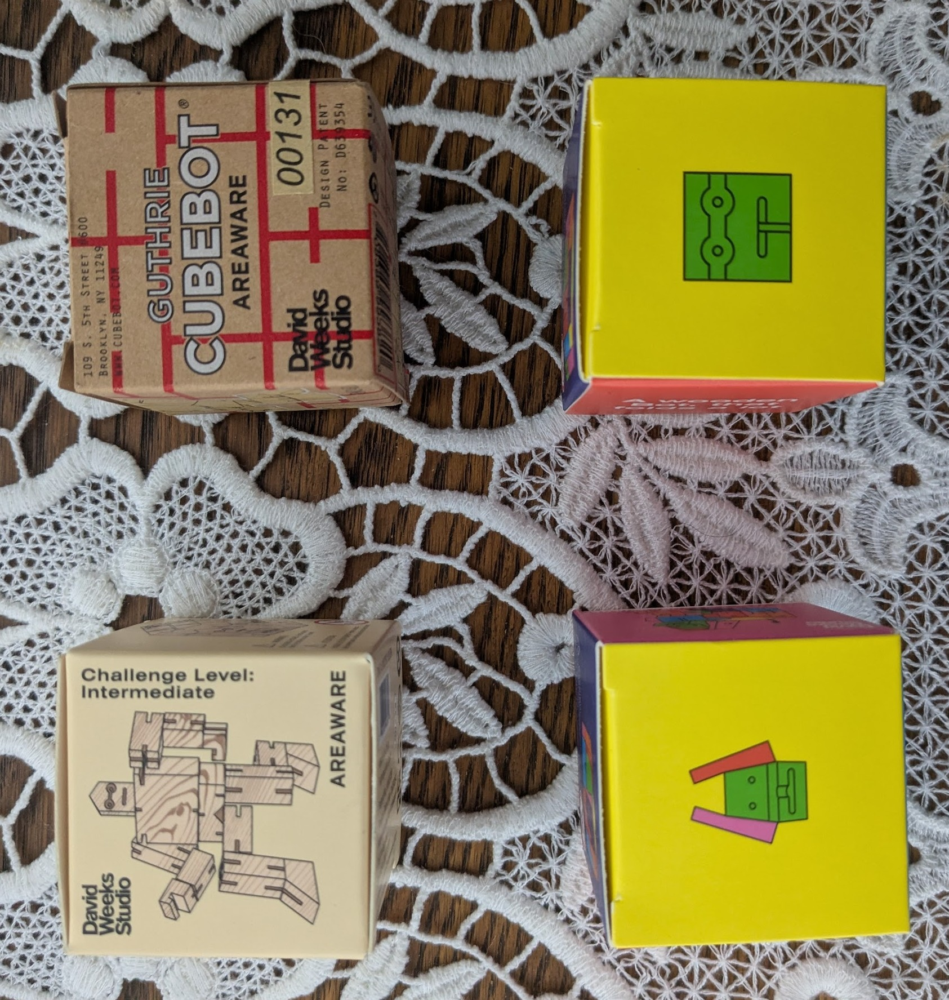
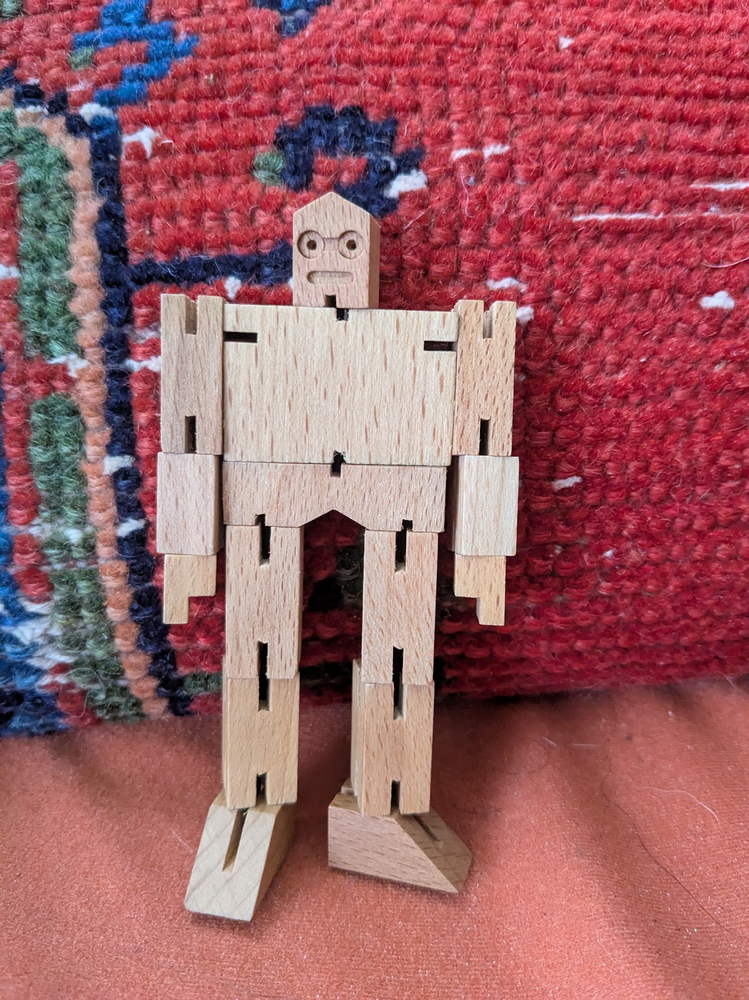
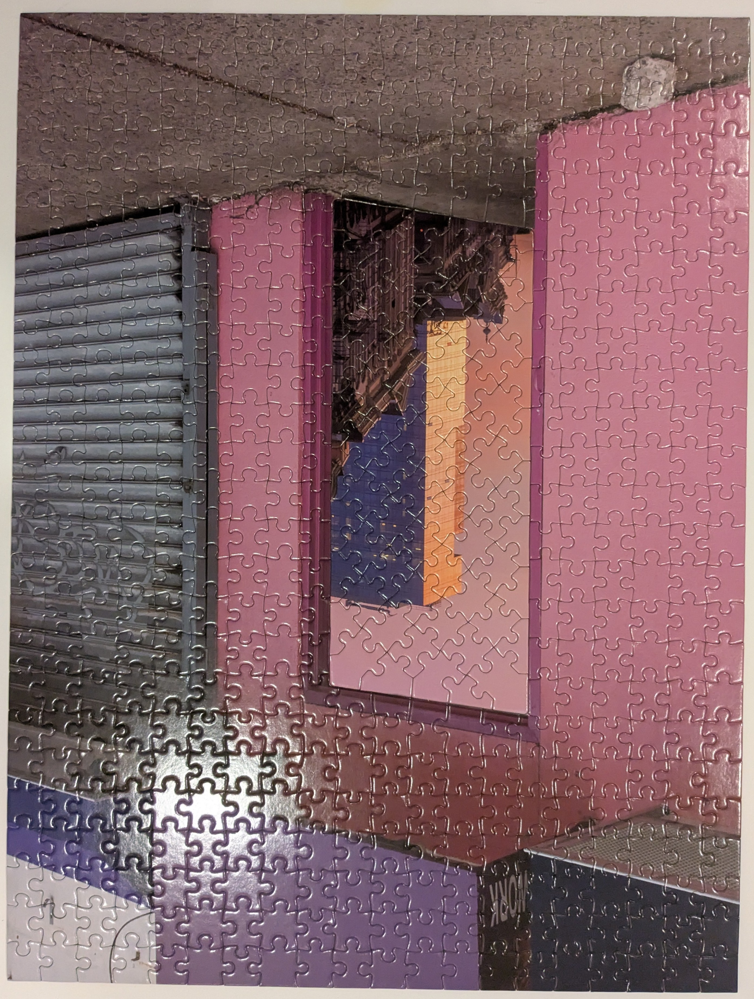
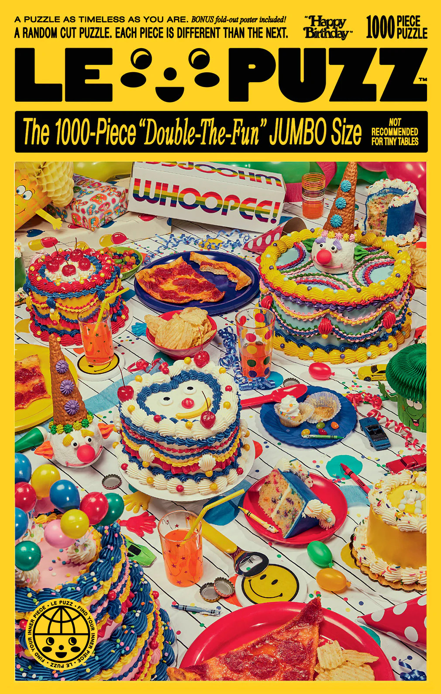

It's been a while since I've written one of these. I realize that I maintain this sort of harmonic existential panic that I am not writing enough. Specifically, I haven't in many years produced any sort of material artifact that documents the project of my personhood; who I am right now is in the minds of the very small number of people who know me well. Or really, just one—Daryl. I guess I want this to be here in case I die, or maybe so I can read it in ten years and play a game of remembering these exact minutes (or attempting to, anyway). My programs and code _are_ effectively one such artifact, but the interpretation thereof also warrants its own artifact, and I'm too lazy and too busy to write a whole epistemology about my own programming.

So I've reconvened on a resolution to use this damned blog thing and write.

## Areaware

This last month, I've found my way into a jigsaw puzzle fixation. It began when Daryl and I took my dad and his wife to the Chihuly Glass Museum in Seattle. They've a gift shop which I presumed would be akin to any other museum gift shop—perhaps a few ostensibly interesting objects which quickly lose their allure courtesy heavy price tags. I was surprised, then, to find reasonable tickets on many items and moreover to find objects that I really, _really_, REALLY liked. Specifically, these little wooden robots that fold into cubes called Cubebots. Cubebots are puzzle/sculptures based on Japanese Shinto Kumi-ki—the designer, David Weeks, has created something like 30 different designs thereof. I love tiny objects and I love puzzles, so these caught my eye.

I ended up acquiring four of them via various venues. Namely, I found a design store called Areaware for which David Weeks made the Cubebots. Cubebots are made with varying difficulties such as the Cubebot Classic, Julien, and Guthrie in order of least to greatest difficulty. Areaware still had Julien, but I had to purchase the Guthrie from the RISD online store. It is with great restraint I only acquired just four (at one point I seriously considered purchasing every single variation all at once).

Here's my Cubebots.

Areaware also creates jigsaw puzzles in collaboration with various designers and artists. Areaware puzzles are like little design objects, with wide, thick boxes bearing wrap-around images. They're incredibly satisfying to collect in series. One such series—Bryce Wilner's Gradient Puzzles—feature various bichromatic or trichromatic gradients in 100, 500, or 1000 pieces. I've a penchant for monochromatic and bichromatic objects, and I furthermore very easily fall for the strange allure of finite collectibles. Needless to say, a few Ebay purchases later and I've completed several Areaware puzzles.

Here's some (though not all) of the Areaware puzzles I've completed thus far:

## Two Months Later...

So, uh...I wrote everything prior to the last set of pictures about ~~one month~~ two months ago. Since, the puzzle thing has broken out into a sort of addiction. I burned through several more Areaware puzzles, including three from an out-of-print series by a Korean photographer and designer, KangHee Kim. The series is called _Puzzle-In-Puzzle_; essentially, each puzzle contains a smaller one therein, analogous to the overlaid photographs Kim has taken. Here's the *Puzzle-In-Puzzle*s I've found and completed thus far:

That last one I found at the Ballard Goodwill, now my favorite spot for finding new puzzles. They typically have an astoundingly good selection. Later, I'll share a vintage 1977 Springbok I purchased there this last weekend.

My fixation has quickly escalated since the KangHee Kim pieces. I began puzzling every day after work and for several hours on the weekends while listening to my ever-expanding checklist of MIT courses on OpenCourseWare.

## Le Puzz

Via an email campaign they sent out, I was apprised of an even greater vendor and puzzle manufacterer called [Le Puzz](https://lepuzz.com/). I suppose it was around this time I became fully possessed by a zeal for the jigsaw. Just _look_ at Le Puzz. They've some of the most cohesive and brilliant design and copy I've ever seen. I love that they arrange their own compositions and conduct photoshoots for their puzzles. I have nearly one dozen of these in my collection now, by way of which I've come to find that random-cut pieces—a dedication to which they pride themselves—are far superior to other, grid-like puzzles.

Just look at how gorgeous this box is!

## Springbok

Reading blogs and watching videos about puzzling also led me to the gold standard of vintage puzzles: Springbok.

As I see it, there's two requisite characteristics I look for in a jigsaw puzzle. One, the pieces must be random-cut. The lack of predictability and novel surprise when some oblong piece magically reveals itself to be an edge piece in ways you had repeatedly thought impossible is highly satisfying. Once you become accustomed to random-cut puzzle pieces, everything else feels awful—especially those glossy, sharp, laser cut grid pieces many new puzzle brands like to use.

Two, I prefer dense, aesthetically balanced—and often just a tad kitschy— compositions—something at which Springbok and Le Puzz (in the inspired tradition of the former) excel. There's something to be said for these puzzle companies back in the 70s and 80s, and how they took these playful risks and made such ludicrous design decisions. Springbok champions this what with their dense collages which might—for those of us born in the nineties—hearken forward to the I-Spy book series and Walter Wick's brilliant photography.

Look at this 1977 Springbok named "Just Your Type". I love the balance of the composition, and the quasi-monochromatic colorway thereof.

Follows is another Springbok I have an eye out for. I like how ridiculous this one is.

Decades later, Springbok pieces behold a delightful tactility and are of superior quality to many newer brands' prints. I love that Springbok puzzles each have a distinct name, akin to the title of a book or a film, and how the box thereof is adorned with thematic sayings, phrases, and paraphernalia. I can certainly see where Le Puzz got their inspiration.

Here's a few of the Springbok puzzles I now own:

That last one is the aforementioned recent find from the Ballard Goodwill.

One more thing I love about jigsaw puzzles is hunting for them in old thrift shops, garage sales, and other venues. Uncovering an unlikely trove of old Springboks is immensely satisfying. I suppose some people extrapolate this same satisfaction from record collecting, a practice in which I avidly partake, but I never have (qua _"extrapolate..."_). Namely because there are so many records, and my tastes are very specific and supposedly eclectic that I won't even waste my time looking at a stack of vinyl I find in those same aforementioned venues in which I find the jigsaw. But puzzles are common enough that you might just find one in the unlikeliest of places, and I don't have to be too fastidious about them beyond the two requisites I mentioned earlier (random-cut pieces with a good composition).

Normally, I get extremely fixated on things for only a few months. Then I grow bored with them and find obsession elsewhere. This is how I've ended up with a fantastic zine collection, a pile of hobo literature, vintage fetish books, a DVD collection of TV Party episodes, and a pile of circuits. That said, this jigsaw puzzle thing has been going steady and strong for some 3 months. I suppose I will continue to partake (eventually intermittently) as a stress relief endeavor. I've thought about creating a blog specifically for jigsaws, or finding a forum on which I can share my finds and swap puzzles with people. Until then, I'll intersperse my writings here with the occasional find, that is assuming my writing panic proves a sufficient motive to return anytime soon. Bye!
