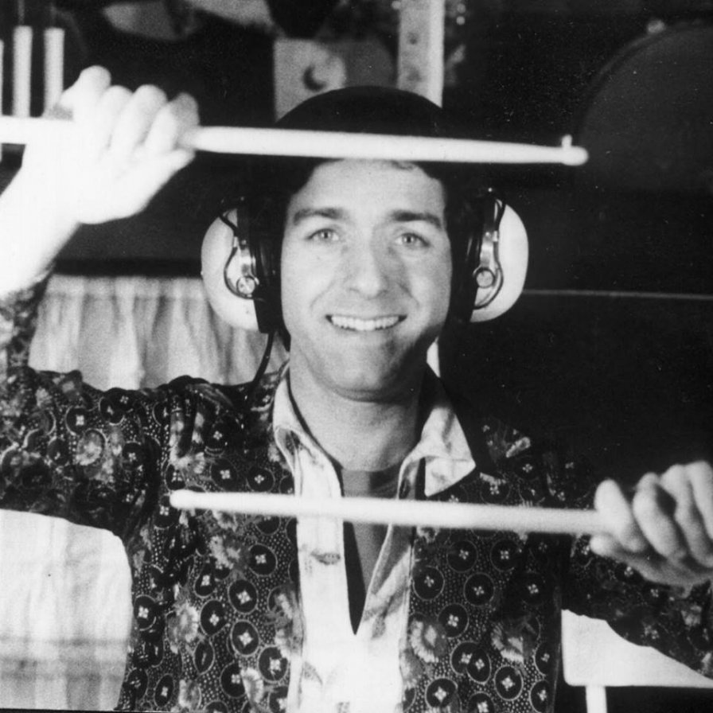
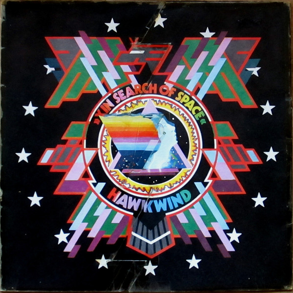

This evening I listened to French-British band Stereloab's [*Emperor Tomato Ketchup*](https://www.youtube.com/playlist?list=PLs9zwqXsceUgmbKm0I_wmEu5YwDQ0fEZ2) (1996) and [*Mars Audiac Quintet*](https://www.youtube.com/playlist?list=PL5SMXYhIcZ5KA9yZlx7WVT1VftzyZ-U-3) (1994), two of my favorite records. It's the first time I've actively listened to music in the nearly 3 years I've suffered from musical anhedonia, a neurological condition characterized by an inability to derive pleasure from music.

Stereolab is one of the most progressive and probably important bands of the 90s. Their contribution to the lineage of music in the modern era is immense. Here's a [live performance](https://www.youtube.com/watch?v=DSXf0RRtSQ8) by them that I think exemplifies how coordinated and talented this band is.

Listening to the [eponymous track](https://www.youtube.com/watch?v=mIzLYSaRWi8&list=PLs9zwqXsceUgmbKm0I_wmEu5YwDQ0fEZ2&index=9) on Emperor Tomato Ketchup, named after a [1971 Japanese experimental film](https://en.wikipedia.org/wiki/Emperor_Tomato_Ketchup_(film)), I was captivated. I've often argued about music that songs and works are fundamentally different; not every album is a collection of songs. Emperor Tomato Ketchup is one such recording. My anhedonia was shattered in this moment and while I can probably attribute that to external circumstances I'm going to go ahead and thank Stereolab for it.

Listening to this track, it's clear that Stereolab isn't merely *influenced* by Krautrock - they *adopted* it and carried it forth. When listening to *Emperor*, one may feel it's impossible this was recorded in 1996 and yet it becomes increasingly easy to reconcile it, the reality that Stereolab is *timeless*.



I love that Stereolab has gained the moniker *Space Rock*, and that's very evident here. An analogue synth dances in the background of the repetitive, [*motorik*](https://en.wikipedia.org/wiki/Motorik) percussion (Andy Ramsay) making sounds that one can only equate with spaceships. Lætitia Sadier's vocals are filtered through a modulating amplifier and at times her electrified voice reaches out like an electronic ghost, otherwise woven into the ether that is *Emperor*. Duncan Brown's bass holds the entire piece together, like a broad backbone that replaces silence and then from which all other sound is derived. Having played music, I can attest that the bass in this piece felt amazing to play, a pleasure and contemplative spaciousness musicians experience that few others do in quite the same way.



The constant time-signature, looping, and layering of melodies creates a complexity that flows indelibly. It's remarkable that the band is this coordinated in a collective goal of producing such soundscapes.

This record as a whole was undeniably well-produced and engineered. The sound quality is impeccable and hearkens to the band's early practice of self-production. This is also where Stereolab announced themselves as true purveyors of Krautrock and the legacy of outfits such as Can and NEU!. These proto-hip-hop arrangements would become more and more pronounced as the band produced records in the subsequent years.

Another beautiful song is Cybele's Reverie, one of my favorites ever. Halfway through the song, Mary Hansen and Lætitia Sadier weave a saccharine, harmonied melody while the band constructs several interspersed patterns. There's something especially intimate about it; Stereolab's music builds as you listen whereas I might say other music has been built and then is presented to you only after.

`video: [Les Yper-Sound](https://www.youtube.com/watch?v=VS062AP7000)`

Les Yper-Sound is the perfect pop song, and I mean this in the truest sense of what pop music is. Stereolab is truly avant-pop in this song, another thing that fascinates me about this band - Stereolab could be described as post-rock but more specifically, avant-pop. The band also draws influence from lounge and 'bachelor pad music' (in this context the band is also considered space rock, or space age pop). In this song, it's so evident the band has a mastery over harmonies and instrumentation. My, what monstrous creativity!

Mars Audiac Quintet is yet another masterpiece of music. Give a listen to Des Etoiles Electroniques. The synth melodies are impressively minimalistic; the band really does employ only exactly what is necessary to construct each composition. One might think this means the band *sounds* minimalist, but instead they create the *need* for more complex textures, and thus the instrumentation is at once minimalistic and highly complex and feature-rich. For the duration of this song, the band iterates over a number of arrangements, each interesting little vignettes into a world of sound that could be, then it ends, punctuated by the melody.

The lyrical content of Stereolab's canon is curious and actually quite philosophical. Take the song Ping Pong for example,

```
There's only millions that lose their jobs
And homes and sometimes accents

There's only millions that die
In their bloody wars, it's alright

It's only their lives and the lives
Of their next of kin that they are losing
```

This entire experience was a much-anticipated pleasantry for me because I've always been heavily invested in music. Even when I was a child, I stayed up until 3 AM to catch the Experimental and Spoken Word shows on KTRU Houston (the rightfully renowned Rice University radio station). Sundays was all day Jazz. I listened to Rahsaan Roland Kirk's The Return of the 5000 Lb. Man, Coltrane's Africa Brass and A Love Supreme. On the Spoken Word show one night, I heard William S Burroughs' hip-hop album Spare Ass Annie, which would eventually evolve into an appreciation for the Proto-Beatniks, Situationists, and Fluxus artists. I always listened to lots and lots of music, especially obscure and lost music through the years.

In high school, I fancied Krautrock and every minute subgenre of Prog Rock. The Canturbery of Soft Machine and Gong; the kraut-folk of Witthuser und Westrupp, Broselmaschine, Holderlin; space rockers HawkWind; and especially Krautrock - namely Can. I also began to study post-punk, No Wave, and Rock in Opposition e.g. Art Bears, Henry Cow, Recommended Records, and Ralph Records. Most recently, I had become obsessed with the Fluxus composers such as La Monte Young, Cornelius Cardew, the band Zs. Perhaps I'll write about these things.

I've carefully curated a vinyl collection since I was 13. Each selection is either a first-pressing or unique version. I once lost my record collection and was depressed over it for some 2 years. I couldn't at the time muster the hope that I could ever recover the thoroughness of my old collection because it would be so financially expensive. I avoided record shops and the mere sight of a vinyl record sent pangs through me. But I couldn't stop wanting records, so I slowly rebuilt the collection far better than it ever was.

Naturally, having developed musical   was very disturbing. I understand the condition is often precipitated by depression, though I wouldn't consider myself depressed. That said, the last two years have been fairly difficult by objective standards, so I can't say I'm all that surprised about it. What's more fascinating is I haven't listened to music in the way I used to since I became captivated by a passion for programming. What might music be like from this new context?

It's this thought that helps me recognize I believe many experiences are different from the mind of a programmer. Programming isn't a mere skill, pasttime, or job; it's a mindset and means of perceiving the world. Listening to Stereolab again I am more than ever preoccupied with the sonic system the band develops, how they curate sounds and how discrete parts communicate with each other.


`video: [YouTube link](https://www.youtube.com/watch?v=Pvgfknx_vq0)`
